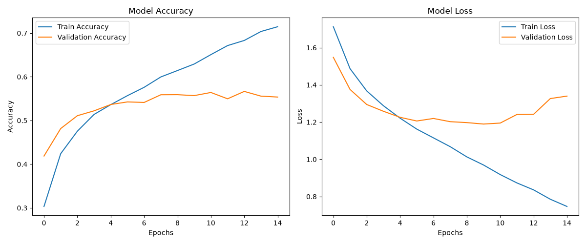
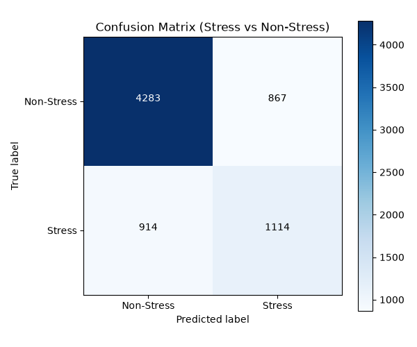

# Student Stress & Emotion Detection System (STINK3014 - Assignment 3)

Comprehensive implementation for UUM Neural Networks course (STINK3014) on **"Facial Images-Based Stress and Emotion Detection Using Deep Learning Technique"**.

This repository contains a full pipeline: training a 7-class CNN model on the FER2013 dataset, deploying a local real-time OpenCV-based webcam application, and hosting a production-grade interactive WebRTC Streamlit Dashboard suitable for cloud deployment.

---

## 📂 Repository Structure

```text
A3/
├── .streamlit/
│   └── config.toml                       # Streamlit server config (enables static serving)
├── Pack01a_BaselineCode/
│   ├── FacialExpressionDetection_Dev.py  # Model training, validation, and history plotting
│   └── fer2013.csv                       # FER2013 dataset file
├── Pack01b_DeploymentCode/
│   ├── FacialExpressionDetection_App.py  # Local OpenCV-based webcam application
│   └── haarcascade_frontalface_default.xml # Haar Cascade face detector
├── Pack02_SUEQ tool/
│   ├── Short_UEQ_Data_Analysis_Tool.xlsx # S-UEQ data processing tool
│   └── UEQS_Items.pdf                    # Bipolar 7-point scale questionnaires
├── docs/
│   ├── Assignment03_Part1_Report.md      # Part I Report (Technical Answers & Architecture)
│   └── Assignment03_Part2_Report.md      # Part II Report (Student Mental Health System Design)
├── frontend/
│   └── index.html                        # WebRTC + MediaPipe + ONNX Web frontend component
├── static/
│   └── emotion_stress_cnn.onnx           # Converted ONNX model for browser inference
├── output/                               # Generated local outputs
│   ├── emotion_stress_cnn.h5             # Saved 7-class Keras CNN model
│   ├── training_history.png              # Accuracy and Loss curves
│   └── stress_log.csv                    # Event logging output
├── app.py                                # Cloud Streamlit Dashboard (Client-side WebRTC inference)
├── appLocal.py                           # Local Streamlit Dashboard fallback (Server-side WebRTC)
├── convert_to_onnx.py                    # Helper script to convert Keras model to ONNX
├── requirements.txt                      # Project dependencies
└── README.md                             # Repository documentation
```

---

## 📈 Model Evaluation & Training Results

Below are the accuracy and loss curves generated after training the 7-class CNN model for 15 epochs on the FER2013 dataset:



Additionally, below is the binary Confusion Matrix (Stress vs Non-Stress) evaluated on the 20% test split:




---

## ⚙️ Environment Setup & Installation

All steps assume execution from the root of the repository.

### 1) Activate Virtual Environment
Windows (PowerShell):
```powershell
.\.venv\Scripts\Activate.ps1
```
Windows (CMD):
```cmd
.\.venv\Scripts\activate.bat
```

### 2) Install Dependencies
For local and cloud deployment, run:
```powershell
pip install -r requirements.txt
```

---

## 🚀 Execution Guide

### Step 1: Train the CNN Model (Baseline & History)
Run the training script to load all 7 classes of the FER2013 dataset, build/compile the deepened CNN, and export accuracy curves:
```powershell
.\.venv\Scripts\python.exe "Pack01a_BaselineCode\FacialExpressionDetection_Dev.py"
```
*Outputs generated in `output/`: `emotion_stress_cnn.h5` and `training_history.png`.*

### Step 2: Run Local OpenCV Webcam Application
Run the local camera detection utility that uses a temporal counter, visual progress bars, audio beep alerts (Windows native), and CSV event logging:
```powershell
.\.venv\Scripts\python.exe "Pack01b_DeploymentCode\FacialExpressionDetection_App.py"
```
*Press `q` on the camera window to exit.*

### Step 3: Run Cloud-Native Streamlit Dashboard (Client-Side Inference)
Run the production dashboard that executes client-side face landmarking and ONNX model predictions directly in the web browser:
```powershell
.\.venv\Scripts\python.exe -m streamlit run app.py
```
*Access via your browser at: `http://localhost:8501`*

### Step 4: Run Local Streamlit Dashboard Fallback (Server-Side WebRTC)
If you wish to run a Streamlit dashboard that processes WebRTC frames on the backend server (similar to traditional Python deployment), run:
```powershell
.\.venv\Scripts\python.exe -m streamlit run appLocal.py
```

---

## ☁️ Live Cloud Deployments

This project is actively deployed and running on both platforms:
* **Hugging Face Spaces**: [Live App](https://huggingface.co/spaces/andyderis/face-expression-detector)
* **Streamlit Community Cloud**: [Live App](https://face-expression-detector.streamlit.app/)

---

## ⚙️ Cloud Deployment Configuration

This project is optimized for direct hosting on **Streamlit Community Cloud** or **Hugging Face Spaces**:
1. **Git LFS for ONNX Model**: Ensure Git LFS is installed and tracking `.onnx` files so the model binary (`static/emotion_stress_cnn.onnx`) is pushed correctly.
2. **Static serving**: Do NOT ignore `.streamlit/config.toml`. It contains `enableStaticServing = true` which allows client browsers to download the ONNX model.
3. **Repository Connection**:
   * Deploy `app.py` as the main entry point.
   * On Hugging Face Spaces, choose the **Streamlit** SDK.
4. The application runs inference fully on the **client-side browser runtime**, resulting in 60 FPS video tracking and zero server-side CPU requirements!

---

## 🛠️ Cloud Deployment Challenges & Engineering Solutions

Hosting real-time computer vision apps on free cloud containers (Streamlit Cloud, Hugging Face Spaces) introduces specific limitations. This project overcomes them using the following solutions:

* **WebRTC NAT / Firewall Traversal (STUN/TURN)**:
  * *Challenge*: Server-side WebRTC components require direct peer-to-peer network streaming. Free cloud containers run behind strict symmetric NATs and firewalls, which block direct ICE candidate negotiation. Without expensive relay TURN servers, connection handshakes fail (causing infinite camera loading loops).
  * *Solution*: Client-side inference. By capturing the camera stream locally and running predictions directly in the client browser's runtime, data frames never leave the user's machine, bypassing cloud network firewalls entirely.
* **Hugging Face Sandbox Iframe Access**:
  * *Challenge*: Hugging Face serves applications inside cross-origin sandboxed iframes. Modern browsers block webcam access (`getUserMedia`) inside iframes for security unless granted explicit permissions.
  * *Solution*: Built a native HTML5 component interface (`frontend/index.html`) that negotiates camera permissions directly inside the iframe's origin scope.
* **Mobile Squishing & Layout Gaps**:
  * *Challenge*: Mobile webcams default to widescreen (16:9) or portrait aspect ratios. Stretching these into a hardcoded 4:3 canvas causes vertical distortion ("gepeng"). Additionally, fixed-height iframe configurations result in massive blank vertical spaces when layout columns stack on mobile.
  * *Solution*: The HTML5 Canvas dynamically resizes (`canvas.width = video.videoWidth`, `canvas.height = video.videoHeight`) to match the stream's aspect ratio 1:1. The Javascript frontend dynamically posts the container's exact height via `setFrameHeight` to Streamlit, shrinking the iframe size in real-time.

---

## ⚠️ Git Configuration & Large Files (.gitignore)

A pre-configured `.gitignore` file is provided. It is **critical** to verify:
* **Dataset (`fer2013.csv`)**: The FER2013 dataset is approximately **300MB** (exceeds GitHub's 100MB file limit). The `.gitignore` is set to ignore `**/fer2013.csv`. You can download it from [Google Drive](https://drive.google.com/file/d/1rYHyg1HR84RycynB0BQ6K2RNE6dwDX_4/view?usp=sharing) and place it inside `Pack01a_BaselineCode/` for local training.
* **Streamlit Secrets (`.streamlit/secrets.toml`)**: Ignored automatically to protect passwords and credentials from being committed.
* **Local Logs (`output/stress_log.csv`)**: Ignored so local data logs don't clash with cloud logs.

---

## 🛠️ Code Customizations & Features

* **Client-Side WebRTC Inference**: Uses MediaPipe and ONNX Runtime Web inside `frontend/index.html` to run facial detection and emotion inference. This eliminates network lag, frame rate caps, and server-side GPU/CPU requirements.
* **Dynamic Iframe Resizing**: Automatically calculates and sizes the Streamlit iframe container based on the device width, preventing large blank gaps in mobile views.
* **Flexible Aspect Ratio**: Canvas dimensions dynamically adapt 1:1 to the camera stream resolution (`video.videoWidth` x `video.videoHeight`), preventing squishing ("gepeng") on portrait and widescreen phone webcams.
* **7-Class Classifier**: Trained on standard FER2013 classes (0: Angry, 1: Disgust, 2: Fear, 3: Happy, 4: Sad, 5: Surprise, 6: Neutral) to distinguish calm states (smiling/neutral) from stress-related expressions (Angry/Fear).
* **Temporal Stress Accumulation**: Accumulates stress counter continuously on consecutive Angry/Fear detections and decays when Calm (Happy/Neutral/Surprise) is detected.
* **HUD Overlay**: Draws boxes, classification tags, and stress progress indicators directly onto HTML5 Canvas, bypassing browser compositing issues.
* **Time-Window Filtering**: Dashboard analytics chart allows filtering logged data to view the last 5, 10, 15, 30 minutes, or 1 hour dynamically.
