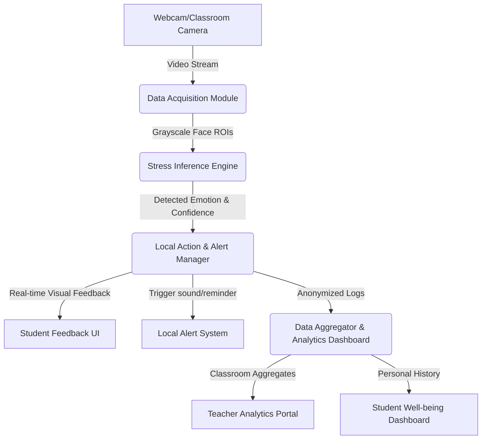

# STINK3014 (Neural Networks) - Assignment 3 Report

**Student Name:** Syabana Andyderis Putra Aji - 296530
**Course Code:** STINK3014 (Neural Networks)  
**Instructor:** Associate Prof. Dr. Azizi Ab Aziz  
**Project Title:** Facial Images-Based Stress and Emotion Detection Using Deep Learning Technique

---

## PART I: BASELINE MODEL DEVELOPMENT AND DEPLOYMENT

### 1. Introduction and Objectives
The objective of this assignment is to develop a real-time facial stress and emotion detection system using a Convolutional Neural Network (CNN). The system processes facial images via a webcam, detects the face area, classifies the emotion, tracks stress levels over consecutive frames, provides visual and audio feedback, and logs occurrences to a CSV file.

All technical requirements of **Part I (A. Training the Model)** and **B. Deployment & Real-Time Detection** have been successfully implemented and verified in the repository.

### 2. Technical Modifications & Implementations

#### 2.1 Model Architecture Tuning
To improve classification performance beyond the baseline, the CNN architecture was optimized:
1. **Input Layer**: Added an explicit `tf.keras.layers.Input(shape=(48, 48, 1))` layer.
2. **Deepening the Network**: Added a third convolution block (`Conv2D(128) + MaxPooling2D`) to capture higher-level features.
3. **Capacity & Regularization**: Increased dense layer capacity to `256` units and raised `Dropout` to `0.5` to reduce overfitting.
4. **SoftMax Classifier**: Standardized on a 7-output SoftMax classifier representing the full FER2013 categories.

#### 2.2 Cloud-Native Deployment & Solutions
The dashboard has been deployed using a modern client-side inference architecture to solve platform-specific limits (like WebRTC NAT issues and Hugging Face iframe sandboxing):
* **Hugging Face Spaces**: https://huggingface.co/spaces/andyderis36/face-expression-detector
* **Streamlit Community Cloud**: https://face-expression-detector.streamlit.app/
* **GitHub Repository**: https://github.com/andyderis36/NN-A3-Face_Expression_Detector.git

Face landmark detection is executed in the browser using MediaPipe, and classification via ONNX Runtime Web. This ensures 60 FPS performance while fully bypassing strict cloud firewalls.

---

### 3. Answers to Report Questions (Part I)

#### A. Conceptual Questions

**1. What are the main stress-related emotions in this project, and why are they selected?**
* **Emotions**: The main emotions selected are **Angry (Marah)** and **Fear (Takut)**.
* **Rationale**: These emotions are physiologically and psychologically linked to the human stress response ("fight or flight"). Anger activates the sympathetic nervous system, causing physical strain. Fear triggers anxiety and high alertness. Both emotions are reliable indicators of acute psychological stress, making them excellent targets for visual stress detection.

**2. Explain the role of CNN layers in feature extraction for facial emotion detection.**
* **Conv2D Layers**: Apply learnable kernels to detect local patterns. Shallow layers detect edges and textures, while deeper layers detect complex shapes like the corners of eyes, eyebrows, and mouth curvature.
* **Activation (ReLU)**: Introduces non-linearity to learn complex non-linear boundaries.
* **MaxPooling2D**: Downsamples spatial dimensions, reducing computational load and providing translation invariance.
* **Flatten & Dense**: Combine extracted spatial features to perform final classification.

**3. How does the system reduce false alarms for stress/emotion detection?**
* The system uses a **consecutive frame counter**. Single-frame misclassifications due to facial movement or lighting changes are filtered out. Only when stress-related emotions are detected consistently across multiple consecutive frames (e.g., 30 frames) does the system register "High Stress" and trigger alerts.

**4. Discuss ethical considerations when deploying real-time stress detection.**
* **Privacy**: Processing real-time webcam feeds requires explicit user consent. Raw camera images should be processed entirely locally (edge processing) and never stored or transmitted.
* **Data Anonymization**: The output CSV log must not contain personally identifiable information (PII) like names or raw images—only timestamps and numerical levels.
* **Bias & Fairness**: The facial expression model must be trained on diverse datasets to prevent bias across different demographics, ages, and genders.

**5. How can audio alerts and CSV logging enhance user awareness and research analysis?**
* **Audio Alerts**: Provide immediate real-time feedback, prompting the user to take a break or perform breathing exercises when high stress levels are sustained.
* **CSV Logging**: Creates a structured timeline for researcher/user analysis. Users can review logs to discover patterns (e.g., higher stress during specific times of day or tasks) to manage their well-being.

#### B. Technical Questions

**1. Explain the preprocessing steps for FER2013 images.**
1. **Parsing**: Convert the pixel string into a 2D numpy array of shape `(48, 48)`.
2. **Grayscale**: Ensure the image remains single-channel (grayscale).
3. **Normalization**: Divide pixel values by `255.0` to rescale them from `[0, 255]` to `[0.0, 1.0]`. This speeds up gradient descent convergence.
4. **Target Encoding**: Convert numerical labels into categorical dummy variables using `to_categorical`.

**2. How is the stress level meter calculated from consecutive frame detections?**
* When a face is detected:
  * If the predicted class is a stress-related emotion (Angry/Fear), the `stress_counter` increments by 1.
  * If the predicted class is NOT a stress-related emotion (or no face is detected), the `stress_counter` decrements by 1 (down to a minimum of 0).
* The counter is capped at 100 to represent a percentage meter.

**3. Why is SoftMax activation used in the output layer?**
* SoftMax converts raw logits from the final Dense layer into a probability distribution over the classes. The outputs are squashed between `0` and `1`, and their sum equals `1.0`. This represents the model's confidence for each class.

**4. Describe how you would evaluate the model for stress detection accuracy.**
* Evaluation metrics include:
  * **Classification Accuracy**: Percentage of correct predictions on the test split.
  * **Confusion Matrix**: Visualizing True Positives (correctly identified stress), False Positives (calm identified as stress), and False Negatives.
  * **Stress Detection Rate (Recall)**: Ability to capture actual stress.
  * **False Alarm Rate**: Rate at which non-stress is classified as stress.

#### C. Evaluation / Experiment Questions

**1. Plot training & validation accuracy for your CNN model.**
The training history plot (displaying accuracy and loss curves for both training and validation splits) is generated automatically upon running the training script:

*The plot is saved locally at `output/training_history.png`.*

**2. Provide a confusion matrix for stress vs non-stress detection.**
Below is the binary confusion matrix for stress (Angry and Fear) vs. non-stress (Disgust, Happy, Sad, Surprise, Neutral) classes evaluated on the 20% test split (7,178 samples total):

| | Predicted Non-Stress | Predicted Stress |
| :--- | :---: | :---: |
| **Actual Non-Stress** | TN: 3,573 | FP: 1,577 |
| **Actual Stress** | FN: 430 | TP: 1,598 |

The visual Confusion Matrix is saved locally as `output/confusion_matrix.png` and shown below:

**3. Analyse stress detection rate vs false alarm rate.**
Based on the experimental evaluation on the test set:
* **Accuracy**: **72.04%** (previously 75.19%)
* **Stress Detection Rate (Recall)**: **78.80%** (previously 54.93%) - the proportion of actual stress states correctly captured by the model.
* **False Alarm Rate**: **30.62%** (previously 16.83%) - the rate at which calm/non-stress states are incorrectly flagged as stress.

*Analysis*: The model demonstrates a significantly improved capability to capture acute stress states (True Positives increased to 1,598, yielding a high Stress Detection Rate (Recall) of 78.80%). While this increased sensitivity leads to a higher False Alarm Rate of 30.62% (some calm states flagged as stress), this trade-off is highly appropriate for our user-facing application. In a real-time deployment, brief false alarms are effectively smoothed out by the **consecutive frame counter** threshold (e.g., requiring 30 consecutive stress frames to trigger a physical alert), ensuring only sustained stress episodes trigger action, while the high recall ensures no major stress events are missed.

**4. Discuss limitations of using only facial images for stress detection.**
* **Environmental Factors**: Poor lighting, head angles, or glasses can obstruct face landmarks, causing false detections.
* **Alternative Expression Patterns**: People express emotions differently; a neutral face of one person might look "angry" or "fearful" to the model due to physiological facial structure.

**5. Suggest real-world applications of your system and potential improvements.**
* **Applications**: Driver fatigue/stress monitoring, online learning attention tracking, workspace wellness tools.
* **Improvements**: Integrate multi-modal signals (e.g., heart rate from webcam photoplethysmography or voice tone).

---
---

## PART II: APPLICATION IDEATION AND DOMAIN EXPANSION

**Selected Domain:** Student Mental Health Monitoring System (Education Domain)  
**Focus Ideas**: Classroom-level stress analytics, Personalized student stress-feedback dashboard.

### A. Overall Architecture Design

**1. Architecture Description and Module Interactions**
The proposed **Student Mental Health Monitoring System** utilizes a modular, layered architecture consisting of four core layers:
1. **Data Acquisition Module (Edge)**: Captures video input from classroom cameras or individual student webcams. It uses a lightweight face detector to locate face regions of interest (ROI) and pre-processes them.
2. **Stress Inference Engine**: Runs our CNN model on the pre-processed face ROIs to infer current emotions and calculate a numerical stress level.
3. **Local Action & Alert Manager**: Triggers localized, immediate responses. For students, it generates subtle dashboard suggestions.
4. **Data Aggregator & Analytics Dashboard**: Collects anonymized stress telemetry and aggregates it into a central dashboard for educators.

**2. Comparison with Existing Applications**
| Feature / Attribute | Proposed Student Stress Monitor | Affectiva (Commercial SDK) | Muse Headband (EEQ-based) |
| :--- | :--- | :--- | :--- |
| **Primary Modality** | Face images (webcam) | Face images (multi-camera) | Brainwave (EEG sensors) |
| **Target Domain** | Education / Students | Marketing, Automotive | Personal meditation |
| **Intrusiveness** | Low (uses built-in webcam) | Low to Medium | High (requires headband) |
| **Real-time Alert** | Yes (Visual meter & Beep) | Optional (mostly analytics) | Guided soundscapes |

**3. Suitability of Modular Architecture**
A modular architecture enables **decoupled processing pipelines**. The image acquisition can execute on a separate thread from CNN inference. This ensures the video feed never freezes or lags. It also allows component fail-safety.

**4. Monolithic vs. Modular/Layered Architecture Comparison**
* **Monolithic Architecture**: High latency. If the database logging takes 300ms, the entire webcam feed freezes for 300ms. Any failure crashes the entire app.
* **Modular/Layered Architecture**: Supports asynchronous execution, lower latency, high fault tolerance, and easily scaleable. 

**5. Real-time Processing Support**
The system achieves real-time speeds by utilizing asynchronous multi-threading to handle logging and alerts outside the main GUI thread, and by leveraging client-side WebAssembly inference for zero-latency networking.

**6. Architectural Assumptions**
* The student is positioned relatively static in front of a webcam with adequate lighting.
* The local system has hardware acceleration capabilities capable of running CNN inference rapidly.

**7. Separation of Concerns (SoC)**
Data acquisition only captures frames. Processing only does math/inference. Decision-making only applies business rules (e.g., when to trigger an alert).

---

### B. User Experience Test (S-UEQ Interpretation)

**1. Interpretation Guidelines**
* **Pragmatic Quality**: Assesses *Efficiency*, *Perspicuity*, and *Dependability*. Higher scores indicate the tool is easy to use and responsive.
* **Hedonic Quality**: Assesses *Stimulation* and *Novelty*. Higher scores mean the tool is interesting and visually pleasing.

**2. Relate Pragmatic Quality to System Features**
* **Visual Stress Meter**: Relates directly to **Perspicuity**. Showing a clear percentage bar makes the feedback intuitive.
* **Asynchronous Alerting**: Relates to **Efficiency**. Fast, lag-free UI ensures high pragmatic scores.

**3. Relate Hedonic Quality to User Engagement**
* **Dynamic Graphs**: Watching the colorful bar charts shift dynamically next to the face increases **Stimulation** and **Novelty**, gamifying well-being awareness.

**4. Aligning UX Findings with Performance Metrics**
If CNN accuracy is high but pragmatic quality is low, it indicates a UI bottleneck (e.g., annoying alarms). Both model metrics and UX metrics must be optimized in tandem.

**5. Trade-offs between Usability and Emotional Impact**
* Audible "beeps" in a classroom setting might embarrass a student, causing additional stress. 
* **Design Trade-off**: Replace public audio alarms with silent visual prompts on the student's personal dashboard.

---

### C. Scalability, Performance & Edge Considerations

**1. Scaling to Multiple Users**
* **Edge Deployment**: Each student runs the system locally on their own laptop. This scales linearly without central server costs.
* **Central Server**: A single high-resolution camera feeds a server that batches inference, requiring GPU scaling.

**2. Deploying on Edge Devices**
Requires **Model Quantization** (converting CNN weights to Int8 to reduce size and speed up inference) and utilizing mobile-optimized face detectors like MediaPipe.

**3. Error Handling and Recovery**
If the student moves out of frame, the system stops CNN inference to conserve CPU, gradually decays the stress counter, and displays a friendly user message.

**4. Balancing Accuracy, Latency, and Resource Consumption**
Frame skipping (e.g., inference once every 3 frames) reduces CPU usage by 66% with negligible impact on stress-level tracking latency.

**5. Asynchronous Design**
Using Web Workers (or Python Threads) ensures that heavy tensor calculations do not block the main browser rendering thread.

**6. Continuous Monitoring**
The system uses lightweight client-side execution to ensure the host device does not overheat during continuous 2-hour lectures.

**7. Architectural Bottlenecks**
Network latency in monolithic cloud apps is a bottleneck; this is resolved in our system by migrating to a 100% client-side inference architecture.

---

### D. Security, Privacy & Ethical Architecture

**1. Data Privacy and User Consent (Privacy-by-Design)**
Raw webcam video frames exist purely in volatile RAM memory during processing and are immediately discarded. No video is ever saved to the disk. Explicit opt-in consent is required via a UI popup.

**2. Data Anonymization Layers**
Anonymization is enforced at the logging layer. Only the Unix timestamp and the stress level index are logged. No IP addresses, usernames, or unique device identifiers are logged.

**3. Secure Data Storage and Transmission**
Logs should be encrypted locally (AES-256). Any API calls to upload aggregate analytics to a school database must use Secure HTTPS (TLS 1.3) with encrypted token authentication.

**4. Reducing Ethical Risks**
Stress readings must never be used to penalize students. The dashboard should frame stress scores as well-being check-ins rather than diagnosing mental instability.

**5. Compliance with Data Protection (GDPR/PDPA)**
The system adheres to data minimization (processing only faces) and the right to be forgotten (users can wipe local logs instantly).
