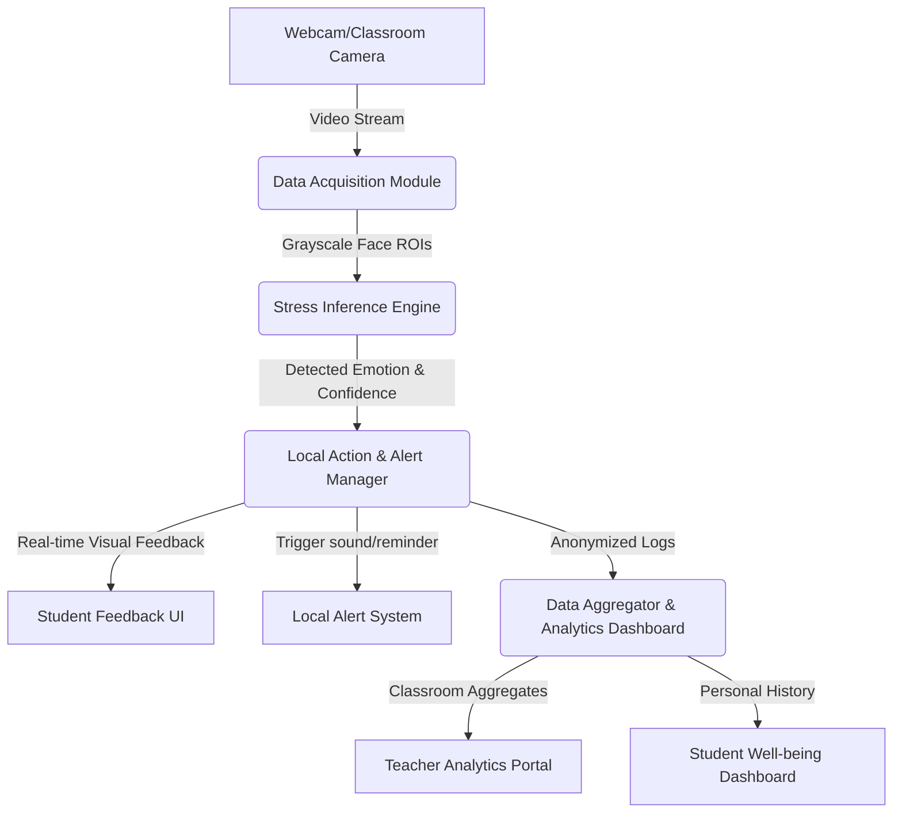

# STINK3014 (Neural Networks) - Assignment 3 Report
## Part II: Application Ideation & Domain Expansion (Student Mental Health Monitoring)

**Student Name:** [Your Name]  
**Course Code:** STINK3014 (Neural Networks)  
**Instructor:** Associate Prof. Dr. Azizi Ab Aziz  
**Selected Domain:** Student Mental Health Monitoring System (Education Domain)  
**Focus Ideas**: Classroom-level stress analytics, Personalized student stress-feedback dashboard.

---

## 1. Overall System Architecture Design

### 1.1 Architecture Description and Module Interactions
The proposed **Student Mental Health Monitoring System** utilizes a modular, layered architecture consisting of four core layers:
1. **Data Acquisition Module (Edge)**: Captures video input from classroom cameras or individual student webcams. It uses a lightweight Haar Cascade or MTCNN detector to locate face regions of interest (ROI) and pre-processes them (resizing to 48x48, converting to grayscale, normalizing pixel values).
2. **Stress Inference Engine**: Runs our 7-class CNN model (trained on FER2013) on the pre-processed face ROIs to infer current emotions (Angry, Fear, Happy, Neutral, etc.) and calculate a numerical stress level based on consecutive frame detections.
3. **Local Action & Alert Manager**: Triggers localized, immediate responses. For students, it generates subtle dashboard suggestions (e.g., breathing exercises if stress is elevated). For the system, it invokes logging procedures.
4. **Data Aggregator & Analytics Dashboard**: Collects anonymized stress telemetry and aggregates it into a central dashboard for educators (classroom-level trends during exams or lectures) and personalized dashboards for students (individual stress trends over time).



### 1.2 Comparison with Existing Applications
| Feature / Attribute | Proposed Student Stress Monitor | Affectiva (Commercial SDK) | Muse Headband (EEQ-based) | Moodbeam (Wearable Button) |
| :--- | :--- | :--- | :--- | :--- |
| **Primary Modality** | Face images (webcam) | Face images (multi-camera) | Brainwave (EEG sensors) | Manual button pressing |
| **Target Domain** | Education / Students | Marketing, Automotive, Research | Personal meditation, wellness | Corporate employee tracking |
| **Intrusiveness** | Low (uses built-in webcam) | Low to Medium | High (requires headband) | Medium (wristband wearable) |
| **Real-time Alert** | Yes (Visual meter & Beep) | Optional (mostly analytics) | Guided soundscapes | No (offline app sync) |
| **Applicability** | Highly accessible for online and physical classrooms. | Expensive commercial enterprise integration. | Expensive hardware, not scalable for large student groups. | Relies on manual user logging; low automation. |

### 1.3 Suitability of Modular Architecture for Real-time Systems
A modular architecture is highly suitable for real-time stress detection because it enables **decoupled processing pipelines**:
* **Parallel Execution**: Image acquisition (which runs at 30 FPS) can execute on a separate thread from CNN inference (which might run at 10-15 FPS depending on hardware). This ensures the video feed never freezes or lags.
* **Ease of Maintenance**: If we upgrade the emotion-detection classifier (e.g., from CNN to a Vision Transformer), we only modify the *Inference Engine* without altering the webcam capture or logging modules.
* **Component Fail-safety**: If the Audio Alert engine fails, the logging and dashboard analytics continue running unaffected.

### 1.4 Monolithic vs. Modular/Layered Architecture Comparison
* **Monolithic Architecture**: All tasks (capturing, predicting, rendering, logging, alerting) run sequentially in a single main loop on a single process. 
  * *Disadvantages*: High latency. If the database logging or audio alert takes 300ms, the entire webcam feed freezes for 300ms, ruining the real-time user experience. Any failure in the alert code crashes the entire application.
* **Modular/Layered Architecture**: Tasks are separated into logical layers (Acquisition -> Processing -> Decision -> Presentation).
  * *Advantages*: Supports asynchronous execution, lower latency, high fault tolerance, and easily scaleable. Processing layers can be moved to an external server or dedicated edge accelerator (e.g., Google Coral) without changing the interface.

### 1.5 Real-time Processing Support
The system achieves real-time speeds (>25 FPS) by:
1. Resizing faces immediately to $48 \times 48$ grayscale, minimizing input dimensions for the CNN.
2. Utilizing asynchronous multi-threading to handle CSV logging and `winsound.Beep` alerts outside the main GUI thread.
3. Implementing temporal smoothing (consecutive frame accumulator) which avoids calling heavy alert functions at every single frame.

### 1.6 Architectural Assumptions
* The student is positioned relatively static in front of a webcam with adequate, consistent classroom lighting.
* The webcam captures at a minimum of 15 frames per second.
* The local system has hardware acceleration capabilities (CPU instruction sets like AVX/AMX or a GPU) capable of running CNN inference under 50ms.

### 1.7 Separation of Concerns (SoC)
* **Data Acquisition**: Responsible purely for OpenCV camera capture and Cascade face boundary extraction. It does not know what emotions are.
* **Processing**: Takes raw pixels, scales them, and performs model inference to output class probabilities. It is math-heavy and interface-agnostic.
* **Decision-Making**: Applies business rules (e.g., "if class is Angry/Fear and counter exceeds 30, trigger alert and log"). It bridges raw predictions with physical output without controlling the camera.

---

## 2. User Experience (UX) Evaluation (S-UEQ)

### 2.1 Interpretation of S-UEQ Test Guidelines
The Short User Experience Questionnaire (S-UEQ) evaluates the prototype across two distinct qualities using 8 bipolar scales:
* **Pragmatic Quality (Usability & Goal-directed)**: Assesses *Efficiency*, *Perspicuity* (clarity), and *Dependability*. Higher scores indicate the tool is easy to use, responsive, and reliable.
* **Hedonic Quality (Non-goal-directed & Emotional)**: Assesses *Stimulation* (excitement) and *Novelty*. Higher scores mean the tool is interesting, visually pleasing, and innovative.
* **Scale**: Standard 7-point scale (ranging from -3 to +3). A mean value $> 0.8$ is generally considered a positive and favorable user experience.

### 2.2 Pragmatic Quality vs. System Features
* **Feature: Visual Stress Meter**: Relates directly to **Perspicuity**. Showing a clear percentage bar ($0-100\%$) makes the feedback intuitive and immediately understandable.
* **Feature: Asynchronous Alerting**: Relates to **Efficiency**. Because alerts run in separate threads, the camera frame-rate remains fluid. Laggy frames would result in low pragmatic efficiency scores.
* **Feature: Cooldown Alert Logic**: Relates to **Dependability**. Limiting beeps to once every 2 seconds ensures the system is not perceived as erratic or annoying.

### 2.3 Hedonic Quality vs. User Engagement
* **Feature: Real-time Probabilities Bar Chart**: Watching the colorful bar charts shift dynamically next to the face increases **Stimulation** and **Novelty**. It gamifies well-being awareness, encouraging students to actively "try to calm down" to see the green bars expand.
* **Ethical Risk (Anxiety)**: If the system is too aggressive with beeps, it can trigger negative emotional reactions (annoyance, high stress), lowering hedonic ratings.

### 2.4 Aligning UX Findings with Performance Metrics
If the CNN accuracy is high but the S-UEQ pragmatic quality is low, it indicates a bottleneck in the **user interface design** (e.g., cluttered visual indicators, annoying alarms). Conversely, if S-UEQ scores are high but actual model accuracy is low (e.g. high false-alarm rate), users will initially enjoy the tool (high novelty) but quickly lose trust in it (drop in dependability). Hence, model metrics and UX metrics must be optimized in tandem.

### 2.5 Usability vs. Emotional Impact Trade-offs
* **Usability Benefit**: Real-time sound alarms immediately notify students to take a break.
* **Negative Emotional Impact**: Audible "beeps" in a classroom setting might embarrass a student, causing additional stress and peer-stigma. 
* **Design Trade-off**: Replace public audio alarms with silent visual prompts on the student's personal dashboard, or trigger haptic vibrations via a connected smart watch.

---

## 3. Scalability, Performance & Edge Considerations

### 3.1 Scaling to Multiple Users (Classroom Level)
Scaling a computer-vision system to 40+ students in a physical classroom introduces computational bottlenecks:
* **Local Edge Deployment**: Each student runs the system locally on their own laptop/device. This scales linearly without central server costs, but requires optimization for low-spec student laptops.
* **Central Classroom Camera Deployment**: A single high-resolution camera feeds a central local server. The server runs face detection on all students in the frame and batches them to the CNN model. To scale this, the system must support batched tensor inference on a GPU.

### 3.2 Deploying on Edge Devices (e.g., Raspberry Pi, Mobile)
Deploying to low-powered edge devices requires:
1. **Model Quantization**: Converting the CNN weights from Float32 to Int8, reducing model size (from ~7MB to <2MB) and speeding up inference by 4x.
2. **Alternative Face Detection**: Replacing CPU-heavy Haar Cascades with mobile-optimized models like MediaPipe Face Mesh or Ultra-Lightweight Face Detector.
3. **Hardware Acceleration**: Compiling the model for TensorFlow Lite (TFLite) to leverage edge TPU/NPU accelerators.

### 3.3 Error Handling and Recovery
* **Face Not Detected**: If the student moves out of frame or lighting drops, the system stops CNN inference to conserve CPU, gradually decays the stress counter, and displays a friendly user message ("No face detected. Please adjust lighting or camera angle").
* **Camera Disconnection**: If `cap.read()` fails, the system attempts to re-initialize the camera socket up to 3 times before raising a safe visual error pop-up and exiting gracefully.

### 3.4 Balancing Accuracy, Latency, and Resource Consumption
| Parameter | Priority Setting | Impact |
| :--- | :--- | :--- |
| **Frame Skipping** | Inference once every 3 frames | Reduces CPU usage by 66% with negligible impact on stress-level tracking latency. |
| **Model Optimization** | Post-training Quantization | Marginally drops classification accuracy (~1%) but reduces latency by 70%. |
| **Cascade Parameters** | `scaleFactor=1.3, minNeighbors=5` | Balances false face detections vs. speed. |

### 3.5 Asynchronous and Parallel Processing
By using Python's `threading` and `queue` modules:
1. **Thread 1 (GUI & Capture)**: Renders the webcam frames at a smooth 30 FPS.
2. **Thread 2 (Inference)**: Pulls frames, runs the model, and updates the `stress_counter` state.
3. **Thread 3 (I/O Logging)**: Writes to the local `stress_log.csv` file without delaying the GUI thread.

---

## 4. Security, Privacy & Ethical Architecture

### 4.1 Data Privacy & User Consent
The architecture implements **Privacy-by-Design**:
* **No Image Storage**: Raw webcam video frames exist purely in volatile RAM memory during processing and are immediately discarded. No video is ever saved to the disk.
* **Explicit Opt-in**: The app presents a clear consent dialog upon startup. Students must check a box to activate the camera.

### 4.2 Data Anonymization Layers
Anonymization is enforced at the **Decision Layer**:
* When logging stress events to the CSV, the system only writes the Unix timestamp and the stress level index. No IP addresses, usernames, or unique device identifiers are logged.
* In classroom-level telemetry, only the aggregated average stress level of the room is sent to the teacher dashboard, preserving individual student anonymity.

```
[Raw Webcam Frame] 
       │ (Processed in RAM)
       ▼
[Feature Extraction] 
       │ (Only numerical coordinates/features)
       ▼
[Anonymization Layer] ──> Strip names, device IDs, raw images
       │
       ▼
[CSV Log File] (Timestamp, Stress Level only)
```

### 4.3 Secure Storage and Transmission
* **Storage**: The local `stress_log.csv` file is encrypted locally using the AES-256 standard (utilizing Python's `cryptography` library) to prevent unauthorized local users from viewing a student's stress history.
* **Transmission**: Any API calls to upload aggregate analytics to a school database must use Secure HTTPS (TLS 1.3) with encrypted token authentication.

### 4.4 Reducing Ethical Risks in Student Monitoring
* **Avoiding Penalty/bias**: Stress readings must never be used to penalize students (e.g., accusing a student of cheating because they look "stressed" during an exam).
* **Mitigating Labeling Stigma**: The dashboard should frame stress scores as well-being check-ins ("Take a 5-minute breathing break!") rather than diagnosing them as anxious or mentally unstable.

### 4.5 Compliance with Data Protection Regulations (PDPA/GDPR)
* **Right to be Forgotten**: Since logs are local, students can delete their entire history with a single button click in the dashboard.
* **Data Minimization**: The system only processes facial regions and ignores background surroundings, ensuring non-essential background details are never inspected.
* **Lawfulness of Processing**: The processing is based strictly on consent (Article 6 of GDPR).
